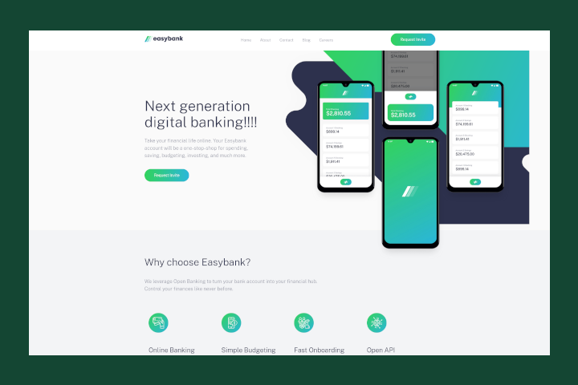
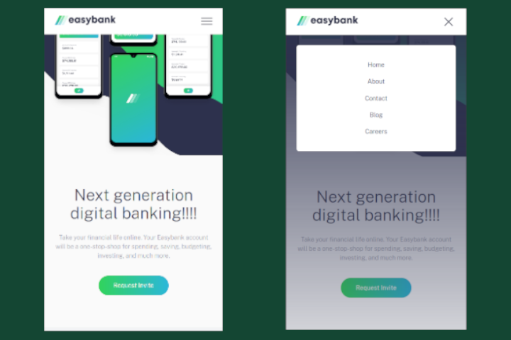

# Easybank Challenge from Frontend Mentor

This project was created from the resources provided by frontend mentor

Check out the final website [here](https://hungry-curie-006f00.netlify.app/#)!

## Important

This landing page stores the css and css.map files in folder "dist". If you fork this project to test changes be aware that by default Watch Sass compiles the css and css.map to root. Either point the Watch Sass extension to compile in folder "dist" or change the stylesheet href in line 20 of index.html to default location.
